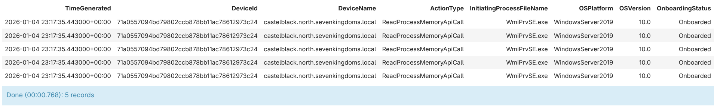

# Day 24

lookup is a handy operator that serves as a join alternative by extending the columns of source table with ones from another table.

# Official Document

[lookup operator](https://learn.microsoft.com/en-us/kusto/query/lookup-operator?view=microsoft-fabric)

# Note

I found out this operator when writing a log search alert rule for a function app to identify consecutive run failures. According to documentation the system assumes the left table is larger than the right table, which is the reason why `lookup` is recommended over join under this scenario. **However, if the right side of the `lookup` is larger than the several tens of MB, the query will fail.** So do think about data size before using `lookup`.

# Gen AI Time

Starting from today, all future days would try to include a section called `Gen AI Time` that attempts to generate the KQL query using Gen AI model and `kusto-mcp`.

## Attempt 1

Let us try a zero-shot first.

### Prompt

> give me an example of lookup operator by using two tables that have shared columns, only take 5 row as result.

Command: `python scripts/generate_kql_query.py "give me an example of lookup operator by using two tables that have shared columns, only take 5 row as result."`

### Result

```json
{
  "request": "Provide an example of lookup operator using DeviceEvents and DeviceInfo tables with shared columns (DeviceId and DeviceName), returning only 5 rows",
  "queries": [
    "// Lookup operator example: enriching DeviceEvents with device information from DeviceInfo\n// The lookup operator matches rows based on shared column values\n\nDeviceEvents\n| where TimeGenerated > ago(7d)  // Filter to recent events\n| lookup kind=inner DeviceInfo on DeviceId, DeviceName  // Inner join enriches with device details\n| project\n    TimeGenerated,\n    DeviceId,\n    DeviceName,\n    ActionType,\n    InitiatingProcessFileName,\n    OSPlatform,           // From DeviceInfo\n    OSVersion,            // From DeviceInfo\n    OnboardingStatus      // From DeviceInfo\n| limit 5                 // Return only 5 rows"
  ],
  "explanation": "This KQL query demonstrates the lookup operator by:\\n\\n1. **Starting with DeviceEvents table**: The primary table that contains event activity\\n\\n2. **Using lookup operator**: `| lookup kind=inner DeviceInfo on DeviceId, DeviceName`\\n   - Matches rows from DeviceEvents with rows from DeviceInfo\\n   - Uses two shared columns for matching: DeviceId and DeviceName\\n   - kind=inner performs an inner join (only returns matching records)\\n   - Other kinds available: inner (default), leftanti, leftantisemi, rightouter, rightsemi, etc.\\n\\n3. **Project columns**: Selects both columns from the left table (DeviceEvents) and enriched columns from the right table (DeviceInfo)\\n   - TimeGenerated, ActionType, InitiatingProcessFileName from DeviceEvents\\n   - OSPlatform, OSVersion, OnboardingStatus from DeviceInfo\\n\\n4. **Limit results**: Returns only 5 rows for demonstration\\n\\nThe lookup operator is useful for enriching one table with related data from another table based on shared column values, similar to a SQL JOIN operation.\"]",
  "tables_used": [
    "DeviceEvents",
    "DeviceInfo"
  ]
}
```

From the result the following KQL expression is obtained:

```kql
// Lookup operator example: enriching DeviceEvents with device information from DeviceInfo
// The lookup operator matches rows based on shared column values

DeviceEvents
| where TimeGenerated > ago(7d)  // Filter to recent events
| lookup kind=inner DeviceInfo on DeviceId, DeviceName  // Inner join enriches with device details
| project
    TimeGenerated,
    DeviceId,
    DeviceName,
    ActionType,
    InitiatingProcessFileName,
    OSPlatform,           // From DeviceInfo
    OSVersion,            // From DeviceInfo
    OnboardingStatus      // From DeviceInfo
| limit 5                 // Return only 5 rows
```

Sadly this is an invalid expression as `lookup` has a different syntax as shown below:

> *LeftTable* `|` `lookup` [`kind` `=` (`leftouter`|`inner`)] `(`*RightTable*`)` `on` *Attributes*

## Attempt 2

Apparently hoping Gen AI model to generate KQL expression without example of the operator is naive. This time I will add a short example.

### Prompt

> Here is the syntax of lookup operator:\n LeftTable | lookup [kind = (leftouter|inner)] (RightTable) on Attributes\n Provide an example of lookup operator using two available tables with shared columns, returning only 5 rows

Command: `python scripts/generate_kql_query.py "Here is the syntax of lookup operator:\n LeftTable | lookup [kind = (leftouter|inner)] (RightTable) on Attributes\n Provide an example of lookup operator using two available tables with shared columns, returning only 5 rows"`

### Result

```json
{
  "request": "Provide an example of lookup operator using DeviceProcessEvents and DeviceInfo tables with shared columns, returning only 5 rows",
  "queries": [
    "// Lookup Example: Join DeviceProcessEvents with DeviceInfo\n// This query demonstrates a left outer lookup that enriches process events with device information\nDeviceProcessEvents\n| where TimeGenerated > ago(7d) // Filter to last 7 days for performance\n| lookup kind=leftouter (DeviceInfo | project DeviceId, DeviceName, OSPlatform, OSVersion, DeviceType) on DeviceId\n| project TimeGenerated, DeviceId, DeviceName, ProcessId, InitiatingProcessFileName, OSPlatform, OSVersion, DeviceType\n| limit 5"
  ],
  "explanation": "This query demonstrates the lookup operator syntax using two related tables:\\n\\n1. **Left Table**: DeviceProcessEvents - Contains process creation and execution events\\n2. **Right Table**: DeviceInfo - Contains device/machine configuration information\\n3. **Shared Column**: DeviceId - Used to join the two tables\\n4. **Join Type**: kind=leftouter - Returns all rows from DeviceProcessEvents and matching rows from DeviceInfo\\n\\nThe query:\\n- Filters DeviceProcessEvents to the last 7 days for better performance\\n- Uses lookup with kind=leftouter to enrich each process event with corresponding device information\\n- Projects (selects) relevant columns including: TimeGenerated, DeviceId, DeviceName, ProcessId, InitiatingProcessFileName, OSPlatform, OSVersion, and DeviceType\\n- Limits results to 5 rows\\n\\nThe lookup operator efficiently joins tables and is preferred over join when the right table is smaller or when you want a simpler syntax for the join operation.",
  "tables_used": [
    "DeviceProcessEvents",
    "DeviceInfo"
  ]
}
```

From the result the following KQL expression is returned:

```kql
// Lookup Example: Join DeviceProcessEvents with DeviceInfo
// This query demonstrates a left outer lookup that enriches process events with device information
DeviceProcessEvents
| where TimeGenerated > ago(7d) // Filter to last 7 days for performance
| lookup kind=leftouter (DeviceInfo | project DeviceId, DeviceName, OSPlatform, OSVersion, DeviceType) on DeviceId
| project TimeGenerated, DeviceId, DeviceName, ProcessId, InitiatingProcessFileName, OSPlatform, OSVersion, DeviceType
| limit 5
```

Still invalid unfortunately, this time the wrong invocation is even worse.

## Attempt 3

There is no attempt 3.

"Why?" you might ask.

It is because **I forgot to load the sample tables into my local Kustainer**! The first attempt actually worked perfectly with zero-shot prompt (well done Haiku).

Lesson of the day: human is prone to error so make sure there are guardrails and double checks in place.

Anyway, here is the query return (I have to remove the line that filters the `TimeGenerated` as the sample data is far older):



## Comment

In summary, providing Gen AI model with sufficient context about KQL operators is equally important