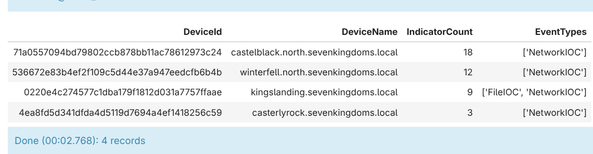

# Day 26

On the back of Trivy scanner project breach, LiteLLM fell as the next victim. 

# Note

According to [LiteLLM](https://docs.litellm.ai/blog/security-update-march-2026#:~:text=We%20believe%20that%20the%20compromise%20originated%20from%20the%20Trivy%20dependency%20used%20in%20our%20CI/CD%20security%20scanning%20workflow.), the compromise originated from a vulnerable Trivy dependency used in their CI/CD security-scanning workflow. This incident demonstrates that security tooling itself can become an attack vector and underscores the importance of supply-chain hygiene and DevSecOps practices.

Recommendations:

- Audit CI/CD pipelines and the security tools they invoke (scanners, linters, builders).
- Pin and verify tool versions; prefer reproducible builds and provenance ([SLSA](https://slsa.dev/how-to/get-started)) where available. Most of the time the version requirements are lax with a minimal version number only. However, this could be exploited by adversary if the dependency's latest matching release is malicious (which is exactly what happened to LiteLLM).
- Rotate and revoke credentials or tokens that may have been exposed, and restrict CI permissions.
- Monitor dependencies and package feeds for unexpected changes or untrusted releases.

# Gen AI Time

## Attempt 1

### Prompt

~~~markdown
Generate a KQL query to find LiteLLM compromise IOCs that match the following criteria:

File indicators:
- Presence of `litellm_init.pth` in site-packages

Network indicators:
- models.litellm.cloud
- checkmarx.zone
~~~

### Result

```json
{
  "request": "Generate a KQL query to find LiteLLM compromise IOCs matching file indicators (litellm_init.pth in site-packages) and network indicators (models.litellm.cloud, checkmarx.zone)",
  "queries": [
    "// Query 1: Detect presence of LiteLLM compromise file indicator\nDeviceFileEvents\n| where FolderPath has "site-packages" and FileName == "litellm_init.pth"\n| project TimeGenerated, DeviceId, DeviceName, FileName, FolderPath, ActionType, InitiatingProcessFileName, InitiatingProcessCommandLine, InitiatingProcessAccountName\n| order by TimeGenerated desc\n",
    "// Query 2: Detect network connections to malicious LiteLLM-related domains\nDeviceNetworkEvents\n| where RemoteUrl has_any ("models.litellm.cloud", "checkmarx.zone")\n| project TimeGenerated, DeviceId, DeviceName, RemoteUrl, RemoteIP, RemotePort, InitiatingProcessFileName, InitiatingProcessAccountName, Protocol\n| order by TimeGenerated desc\n",
    "// Query 3: Unified view - both file and network indicators\nlet FileIndicators = DeviceFileEvents\n| where FolderPath has "site-packages" and FileName == "litellm_init.pth"\n| project DeviceId, DeviceName, IndicatorType="FileIOC", Indicator=FileName, Details=strcat(FolderPath, "\\\\", FileName);\nlet NetworkIndicators = DeviceNetworkEvents\n| where RemoteUrl has_any ("models.litellm.cloud", "checkmarx.zone")\n| project DeviceId, DeviceName, IndicatorType="NetworkIOC", Indicator=RemoteUrl, Details=RemoteUrl;\nunion FileIndicators, NetworkIndicators\n| summarize IndicatorCount=count(), EventTypes=make_set(IndicatorType) by DeviceId, DeviceName\n| where IndicatorCount > 0\n| order by IndicatorCount desc"
  ],
  "explanation": "This solution provides three complementary KQL queries to detect LiteLLM compromise indicators:\\n\\n**Query 1** focuses on the file indicator by searching DeviceFileEvents for the suspicious \\"litellm_init.pth\\" file within site-packages directories (typical Python package location). This query will identify any device where this malicious file has been created or modified.\\n\\n**Query 2** targets network indicators by searching DeviceNetworkEvents for outbound connections to the two malicious domains: \\"models.litellm.cloud\\" and \\"checkmarx.zone\\". This helps detect command and control (C2) communications or data exfiltration attempts.\\n\\n**Query 3** provides a consolidated view by combining both file and network indicators into a single result set. It uses union to merge the two data sources and then summarizes by device to show which devices exhibit LiteLLM compromise indicators (file, network, or both). This makes it easy to identify impacted systems and correlate indicators across detection types.\\n\\nAll queries are ordered by TimeGenerated in descending order to show the most recent events first, and include relevant context fields like device name, initiating process information, and network details for investigation.",
  "tables_used": [
    "DeviceFileEvents",
    "DeviceNetworkEvents"
  ]
}
```

Stats:

| Token Type | Value |
| ---------- | ----- |
| Input      | 8307  |
| Output     | 981   |
| Total      | 9288  |

From the return above we get the following KQL queries (this time Haiku decided to have multiple queries instead of a single one):

```kql
// Query 1: Detect presence of LiteLLM compromise file indicator
DeviceFileEvents
| where FolderPath has "site-packages" and FileName == "litellm_init.pth"
| project TimeGenerated, DeviceId, DeviceName, FileName, FolderPath, ActionType, InitiatingProcessFileName, InitiatingProcessCommandLine, InitiatingProcessAccountName
| order by TimeGenerated desc
```

Valid query, worked without change needed.

```kql
// Query 2: Detect network connections to malicious LiteLLM-related domains
DeviceNetworkEvents
| where RemoteUrl has_any ("models.litellm.cloud", "checkmarx.zone")
| project TimeGenerated, DeviceId, DeviceName, RemoteUrl, RemoteIP, RemotePort, InitiatingProcessFileName, InitiatingProcessAccountName, Protocol
| order by TimeGenerated desc
```

Same as the first query, worked perfectly.

```kql
// Query 3: Unified view - both file and network indicators
let FileIndicators = DeviceFileEvents
| where FolderPath has "site-packages" and FileName == "litellm_init.pth"
| project DeviceId, DeviceName, IndicatorType="FileIOC", Indicator=FileName, Details=strcat(FolderPath, "\\\\", FileName);
let NetworkIndicators = DeviceNetworkEvents
| where RemoteUrl has_any ("models.litellm.cloud", "checkmarx.zone")
| project DeviceId, DeviceName, IndicatorType="NetworkIOC", Indicator=RemoteUrl, Details=RemoteUrl;
union FileIndicators, NetworkIndicators
| summarize IndicatorCount=count(), EventTypes=make_set(IndicatorType) by DeviceId, DeviceName
| where IndicatorCount > 0
| order by IndicatorCount desc
```

This query is a surprisingly solid one, checking for each IOC type before unioning all types for human friendly output makes it feel like written by someone who know his/her/its stuff. The query result looks like this (like other queries since I don't have the exactly matching values I changed the values to search so that it returned rows):




# Links
- [Security Update: Suspected Supply Chain Incident](https://docs.litellm.ai/blog/security-update-march-2026)
- [Your AI Gateway Was a Backdoor: Inside the LiteLLM Supply Chain Compromise](https://www.trendmicro.com/en_us/research/26/c/inside-litellm-supply-chain-compromise.html)
- [LiteLLM PyPI Package Compromise](https://digital.nhs.uk/cyber-alerts/2026/cc-4761)
- [Shedding The Lite: Unfolding The Dramatic Turn of Events with the LiteLLM Compromise](https://cycode.com/blog/lite-llm-supply-chain-attack/)
- [LiteLLM Breach IOC](https://documents.trendmicro.com/assets/txt/Your-AI-Gateway-Was-A-Backdoor_IOCS-iIalxJu.txt)
