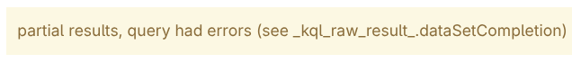
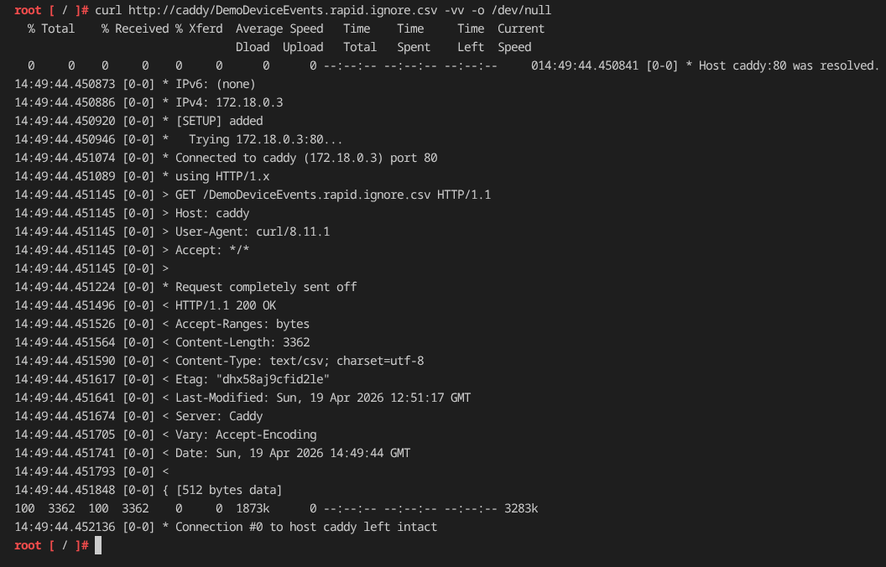
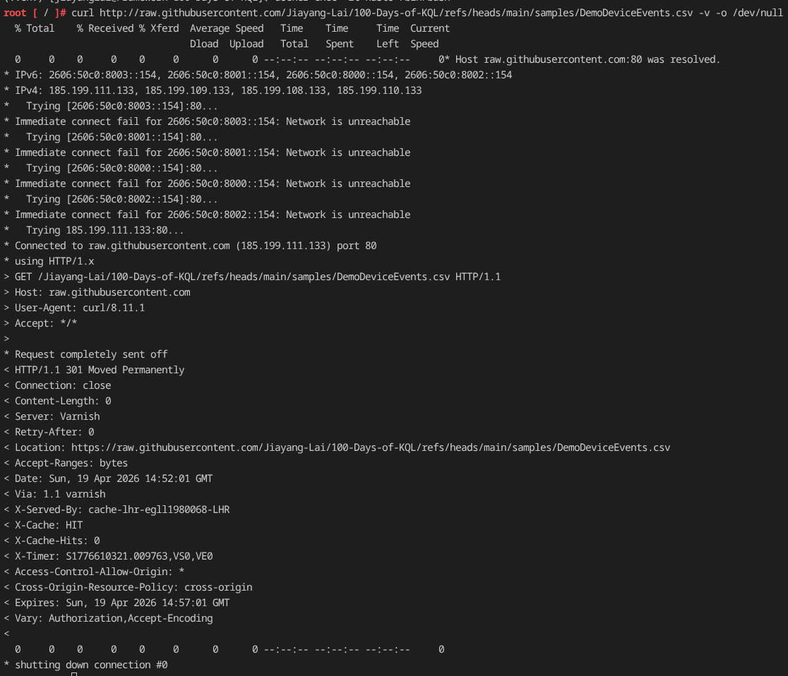
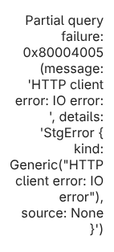
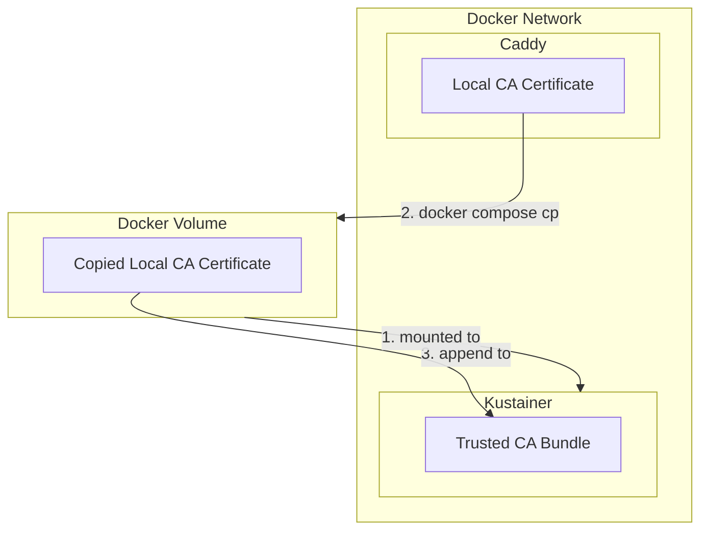
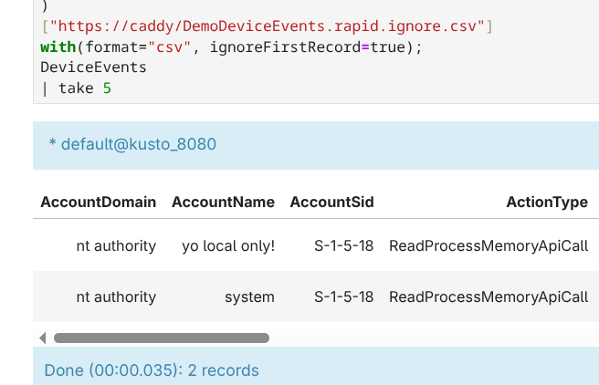

# Day 28

Today we are doing some chores and bringing some QoL updates to the project as listed below:

- Implement data persistency for Jupyter notebook container.
- Refactor the docker compose file to use docker network rather than links
- Add a file server sitting within local docket network and let Kustainer pull test data from it.

Spoiler alert: it didn't go smoothly and required a bespoke solution. 

# Official Document

[.show queries command](https://learn.microsoft.com/en-us/kusto/management/show-queries-command?view=microsoft-fabric)

# Note

## Road to Fully Local Development Workspace

### Implement Data Persistency for Jupyter

As much as I like Ctrl+c then v, redoing the whole setup process within Jupyter notebook is jarring. So I created a volume for Jupyter container to persist the notebooks [here](../docker/jupyter). I wrote a `workbench.ipynb` for curious readers to quickly set up their KQL environment within Jupyter.

### Networking Refactor

The current docker compose uses [links](https://docs.docker.com/compose/how-tos/networking/#link-containers) to establish connectivity from Jupyter service to Kustainer. Since we are adding another service that requires connectivity between the existing duo, using a defined docker network and moving all service into it would be the best approach. Therefore, I declared a docker network `kusto_network` and associated it with services.

### Adding Caddy as the Local File Server

As mentioned in the starting section, we want to eliminate the last remote component: the file server. Currently, our data are stored within a GitHub repository and Kustainer pulls data from it. While it works perfectly, a few pain points stick out:

1. To update dataset, I have to modify the file and commit to GitHub. It works now but is not ideal for rapid iteration, and git should not be used for this purpose.
2. Kustainer still has to reach out to Internet for data retrieval, my broadband holds up now, but I would love to move the file endpoint to LAN to reduce the potential bottleneck (I doubt I'll ever hit it haha).

When I refactored the docker compose file from using links to network, everything seemed to work as before. The Jupyter notebook worked and was able to connect to Kustainer for interaction. Then I added the Caddy container as the local file server so that Kustainer can load test logs within the local network directly. However, the Kustainer failed to retrieve file from Caddy with a vague error message:



My educated guess was that Kustainer only allows HTTPS destinations but to be comprehensive I did a thorough check. Firstly, I enabled the debug logging for Caddy and ran the request again. Interestingly there was no sign of Kustainer hitting Caddy server. What was more interesting is that when I ran curl within the Kustainer container curl was able to pull the file:



Then I ran the command to pull the CSV file from GitHub repository and got this log:



As the log clearly stated, when Curl requested `https://` GitHub redirected to `https://` (quite common for modern sites). Then I also ran some management KQL queries to pull out the actual error message.

Here is the management command:

```kql
.show queries 
| top 3 by StartedOn desc
```

From the return I could see the actual error message:



This validated my guess of mandatory TLS, so theoretically I could simply let Caddy generate a self-sign cert for TLS and Kustainer would gladly pull files.

To achieve this, I simply changed the Caddy file to use self-signed TLS certificates. Sadly this did not work as Kustainer strictly checks the certificate chain according to this error message:

`{"level":"debug","ts":1776611812.9288774,"logger":"http.stdlib","msg":"http: TLS handshake error from 172.18.0.4:44454: local error: tls: bad record MAC"}`

Then I asked myself: "Why not make the Kustainer trust the certificate?", which was actually a great idea. So I went back to the drawing board and designed this:



If the diagram doesn't make sense to you here are the steps:

1. Create a volume for Kustainer to mount.
2. Spin up the docker compose resources.
3. Service Caddy will create its local CA certificate.
4. Use `docker compose cp` to copy the `root.crt` from `/data/caddy/pki/authorities/local/root.crt` within Caddy service to the directory the volume binds to.
5. Run `docker exec <script here>` to append the `root.crt` to `/etc/ssl/certs/ca-certificates.crt`.

For the actual commands, look into [Makefile](../Makefile) on target `trust`.

After adding the local CA certificate to Kustainer's trusted TLS certificate file, Kustainer was finally able to pull the test data from Caddy:



Implementing local log retrieval is a solid step towards the agent harness plan as my vision is to allow the test data to be rapidly iterated for local agent workflow.

# Gen AI Time

Let's see if LLM can write KQL management expression.

## Attempt 1

### Prompt

Since there is not really a table for the output, I went ahead and copied the command guide as the context in prompt [here](day-28.prompt.md).

### Result

```json
{
  "request": "Write a KQL query that uses the `.show queries` command to list the 5 most recent failed queries, including the failure reason, query and helpful stats.",
  "queries": [
    ".show queries\n| where State == \"Failed\" and isnotempty(FailureReason)\n| sort by LastUpdatedOn desc\n| take 5\n| project StartedOn, LastUpdatedOn, Duration, State, FailureReason, Text, User, Database, TotalCpu, MemoryPeak, Application"
  ],
  "explanation": "This query uses the `.show queries` command to retrieve query execution history from the Kusto cluster. It then:\\n\\n1. Filters for failed queries only using `where State == \\\"Failed\\\" and isnotempty(FailureReason)` to ensure we only get queries that actually failed with a reason\\n2. Sorts by `LastUpdatedOn` in descending order to get the most recent failures first\\n3. Limits results to the 5 most recent failures using `take 5`\\n4. Projects relevant columns including:\\n   - **Timing info**: StartedOn, LastUpdatedOn, Duration\\n   - **Failure info**: State, FailureReason, Text (the actual query)\\n   - **Execution context**: User, Database, Application\\n   - **Resource stats**: TotalCpu, MemoryPeak\\n\\nThis provides a comprehensive view of the most recent query failures with both diagnostic information and resource consumption metrics.",
  "tables_used": [
    "queries (from .show queries command)"
  ]
}
```

Stats:

| Token Type | Value |
| ---------- | ----- |
| Input      | 2222  |
| Output     | 430   |
| Total      | 2652  |

Got ourselves a solid query:

```kql
.show queries
| where State == "Failed" and isnotempty(FailureReason)
| sort by LastUpdatedOn desc
| take 5
| project StartedOn, LastUpdatedOn, Duration, State, FailureReason, Text, User, Database, TotalCpu, MemoryPeak, Application
```

Worked perfectly, nothing to complain.

# Links
- [What is difference between /etc/ssl/certs/ca-bundle.crt and /etc/ssl/certs/ca-bundle.trust.crt in centos7?](https://stackoverflow.com/questions/37210745/what-is-difference-between-etc-ssl-certs-ca-bundle-crt-and-etc-ssl-certs-ca-bu)
- [Enabling automatic trust for self-signed certificates in containers during local development with .NET Aspire](https://anthonysimmon.com/dotnet-aspire-containers-trust-self-signed-certificates/#a-bit-of-context-on-self-signed-certificates-and-containers)
- [Local HTTPS with Dockerised Caddy](https://caddyserver.com/docs/running#local-https-with-docker)